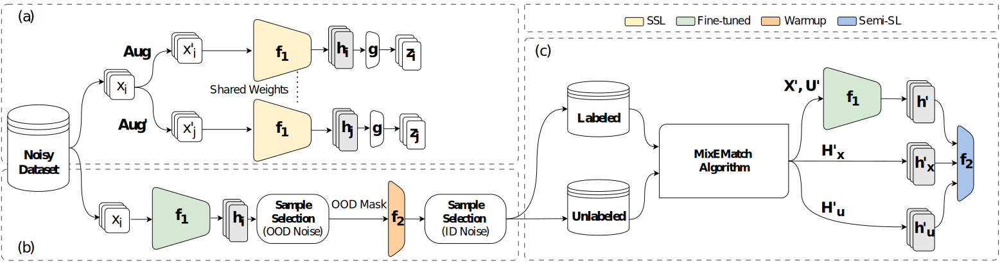

### Manifold DivideMix: A Semi-Supervised Contrastive Learning Framework for Severe Label Noise

*Fahimeh Fooladgar[^1], Minh Nguyen Nhat To[^1], Parvin Mousavi[^2], Purang Abolmaesumi[^1]*

[^1]: University of British Columbia
[^2]: Queen's University



Deep neural networks have proven to be highly effective when large amounts of data with clean labels are available. However, their performance degrades when training data contains noisy labels, leading to poor generalization on the test set. Real-world datasets contain noisy label samples that either have similar visual semantics to other classes (in-distribution) or have no semantic relevance to any class (out-of-distribution) in the dataset. Most state-of-the-art methods leverage ID labeled noisy samples as unlabeled data for semi-supervised learning, but OOD labeled noisy samples cannot be used in this way because they do not belong to any class within the dataset. Hence, in this paper, we propose incorporating the information from all the training data by leveraging the benefits of self-supervised training. Our method aims to extract a meaningful and generalizable embedding space for each sample regardless of its label. Then, we employ a simple yet effective K-nearest neighbor method to remove portions of out-of-distribution samples. By discarding these samples, we propose an iterative `Manifold DivideMix` algorithm to find clean and noisy samples, and train our model in a semi-supervised way. In addition, we propose `MixEMatch`, a new algorithm for the semi-supervised step that involves mixup augmentation at the input and final hidden representations of the model. This will extract better representations by interpolating both in the input and manifold spaces.
Extensive experiments on multiple synthetic-noise image benchmarks and real-world web-crawled datasets demonstrate the effectiveness of our proposed framework.


---

<!--  >> Codes will be uploaded soon ... -->


## Running the code

<!-- First you need to install dependencies by running `pip install -r requirements.txt`. -->

You can download pretrained self-supervised models from 
[Dropbox](https://www.dropbox.com/scl/fo/jp8u80wrkj7z07f0mlpxb/h?rlkey=h24ging0at95emwc6yr0dklxg&dl=0) and put them into `./save` folder 

Then you can run the code for CIFAR
```
python train_semisup.py --weights finetune --data-dir /path/to/cifar100 --exp-dir <experiment-dir>  --pretrained <path-of-pretrained-ssl-model> --arch resnet18 --ood-ratio 0.2 --noise-ratio 0.2 --warmup-epoch 20 --epochs 300 --clustering True --lr-head 0.2 --lr-backbone 0.002 --interval 10
```
for Mini-Imagenet dataset
```
python3 train_semisup_miniimagenet.py --weights finetune --data-dir /path/to/mini-imagenet --exp-dir <experiment-dir>  --pretrained <path-of-pretrained-ssl-model> --arch resnet18 --ood-ratio 0.2 --noise-ratio 0.2 --warmup-epoch 10 --epochs 50 --clustering True --lr-head 0.2 --lr-backbone 0.002 --interval 10
```
<!-- or for mini-WebVision
```
python3 train_semisup_miniimagenet.py --weights finetune --data-dir /path/to/mini-webvision --exp-dir <experiment-dir>  --pretrained <path-of-pretrained-ssl-model> --arch resnet18 --ood-ratio 0.2 --noise-ratio 0.2 --warmup-epoch 10 --epochs 50 --clustering True --lr-head 0.2 --lr-backbone 0.002 --interval 10
```
-->
---


## Cite ManifoldDivideMix
<pre>
@inproceedings{fooladgar2024manifold,
  title={Manifold DivideMix: A Semi-Supervised Contrastive Learning Framework for Severe Label Noise},
  author={Fooladgar, Fahimeh and To, Minh Nguyen Nhat and Mousavi, Parvin and Abolmaesumi, Purang},
  booktitle={Proceedings of the IEEE/CVF Conference on Computer Vision and Pattern Recognition},
  pages={4012--4021},
  year={2024}
}</pre>
